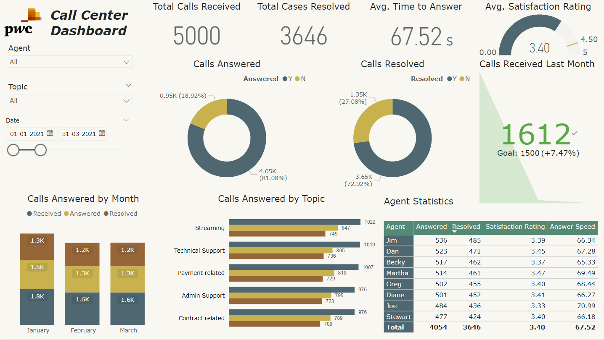
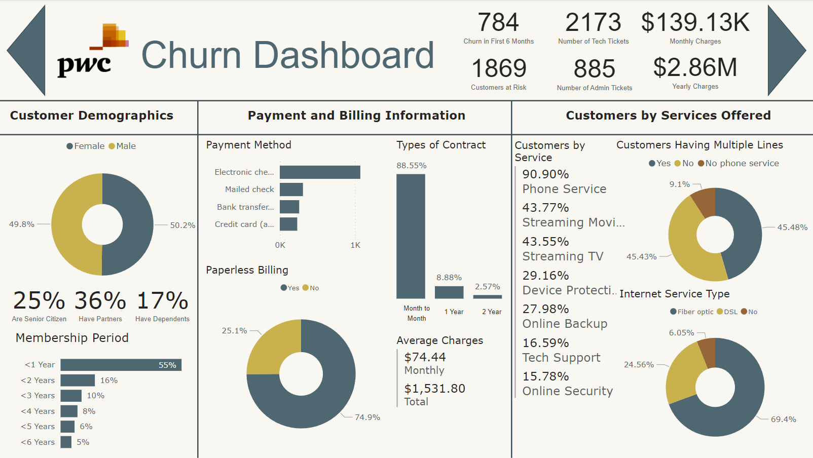
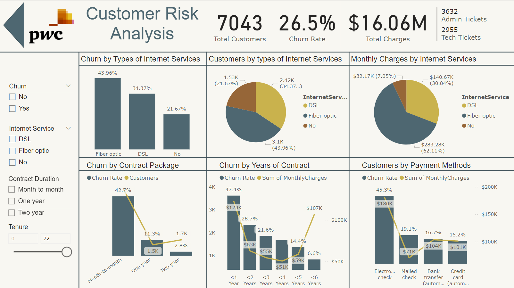
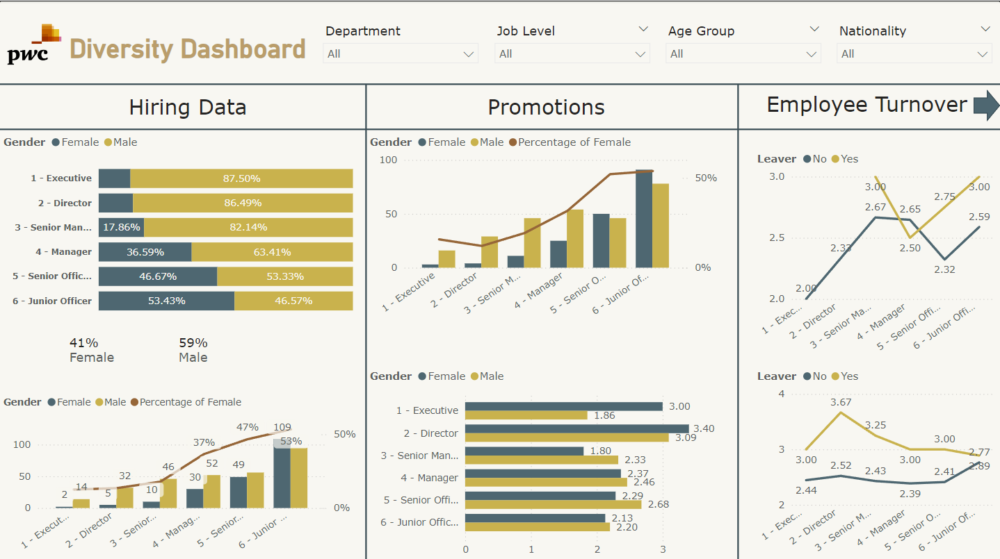
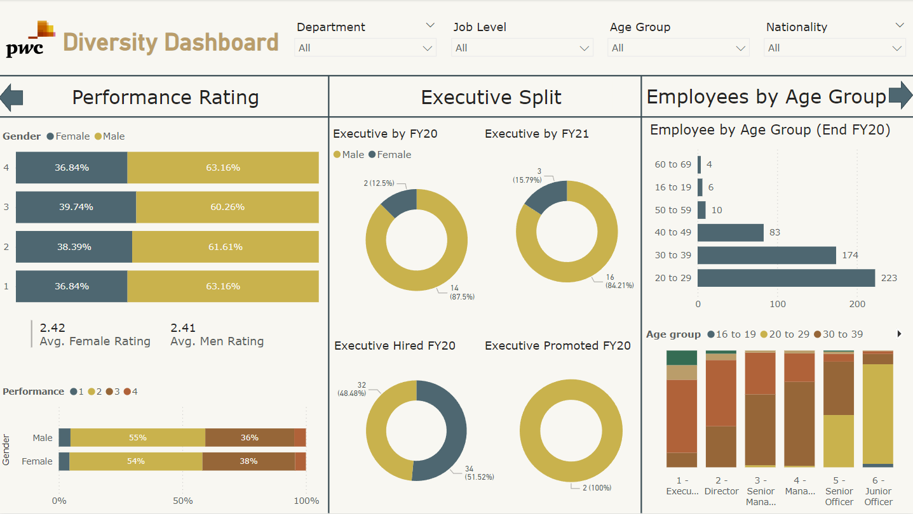
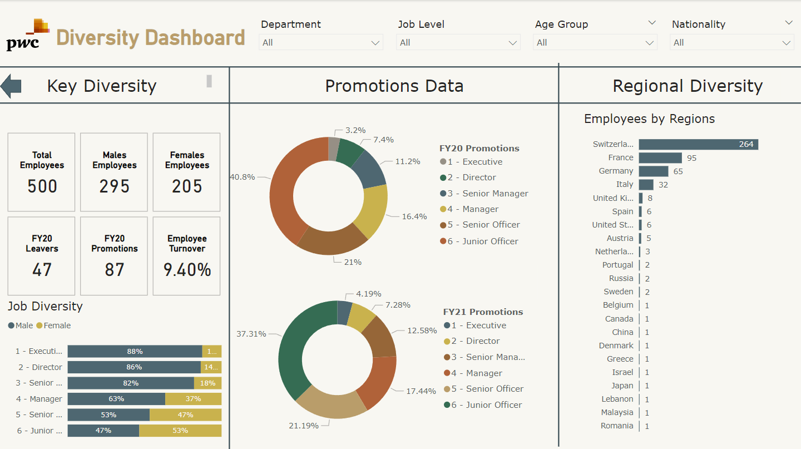

# PwC Power BI Virtual Internship
Hi, thank you for checking out my Power BI project for the PwC Switzerland Power BI Job Simulation by Forage. This project involves creating a series of Power BI dashboards based on the call center, customer churn, and diversity and inclusion datasets. The dashboards aim to provide comprehensive insights into various aspects of the business operations and customer dynamics.

# Call Center Trends Dashboard

This task requires you to analise and clean call center dataset and create a dashboard in Power BI that displays all the relevant KPIs and metrics related to call center trends. 

This Dashboard includes:

1. **Avarage Customer Satisfaction:** This KPI measures the satisfaction level of customers who contacted the call center for support. 
2. **Overall Calls Resolved:** This KPI measures the number of calls resolved by agents versus the number of calls unresolved, allowing us to focus on meeting our expected goals. 
3. **Calls Answered by Topic:** This KPI measures the volume of calls for different catagories and also informs the number of calls received, answered and resolved which can let us know which specific areas we should focus on. 
4. **Average Time to Answer:** This KPI displays the average time taken by agents to answer the customers customer calls in seconds. This KPI can allow us to help meet our goals and check for issues with response time in specific cases.
5. **Agent Staistics:** This table displays the KPIs of each agents and allows us to short the list in real time to find out the best performing agents for each pereformence metric.

# Customer Churn Dashboard

In this task I have Analysized the customer churn dataset and created a dashboard for the retention manager so they can make business decisions based on the dataset to track and improve customer retention rate. After creating the dashboard I sent a short email to the engagement partner explaining the findings, and include suggestions as to what needs to be changed. [Check the e-mail.](/Customer_Churn_Data_Analysis/E-mail_to_retention_manager.docx)

This Dashboard includes:

1. **Customer Demographics:** This section contains valueable data such as the percentage of customers divided by gender and whertehr they are a senior citizen, if they have partners or dependents. Also there is a vizualization catagorizing customers by thier membership period. 
2. **Payment and Billing Information:** This section contains information about payment and billing used by the customers to pay for the services. important details such as which payment method was used, the type of contract and avarage charges for the services.
3. **Customers by Services Offered:** In this section we can see the customer segmentaion by the type of services they are subcriebd to and how many customers may be suing multiple lines and if its a phone service.
4. **Customer Churn Rate:** This KPI displays the average churn rate of customers accross all services. Multiple vizualizations show churn by various metrics such as type of contract or payment methods allowing us to take actionable steps and make business decisions.
5. **Total Tickets Opened:** These two KPIs show total tickets opened by customers for tech related issues and tickets opened for administrative assistance. this allows us to understand customer needs and focus on the area which can help resolve customer pain.

# Diversity & Inclusion Dashboard

Companies need a workforce of diverse talents and backgrounds to succeed in an increasingly complex and heterogeneous world. In this task I created a Dashboard after analyzing the company employees dataset.

This Dashboard includes:

1. **Hiring Data:** This section contains KPIs related to hiring data and gender diversity.
2. **Promotions and Employee Turnover:** The data here give insights about promotions and employee turnover rate by both genders and showcases the percentage differences.
3. **Performence Rating:** In this section we can see the diversity between 4 performence groups by performence score and the average performence rating for each group.
4. **Executive Split:** This section shows data on executives hired and promotions to executive positions by direrent genders.
5. **Employees by Age Group:** These two charts show total employees by age and gender to get an outlook on the age groups of employees.
6. **Key Diversity:** This section shows important KPIs and job diversity between all levels of employees, allowing us to gain valueable insights to make hiring decisions for the company.

# Conclusions
Thanks again for going thorugh the reading, this job simulation has an excellent opoortunity to grow my data analysis skills.

 * By Completing the job simulation I strengthened my Power BI skills to better understand clients and their data visualisation needs. 

 * Demonstrated expertise in data visualization through the creation of Power BI dashboards that effectively conveyed KPIs, showcasing the ability to respond to client requests with well-designed solutions.

 * Strong communication skills reflected in the concise and informative email communication with engagement partners, delivering valuable insights and  actionable suggestions based on data analysis.

 * Leveraged analytical problem-solving skills to examine HR data, particularly focusing on gender-related KPIs, and identified root causes for gender balance issues at the executive management level, highlighting a commitment to data-driven decision-making.
